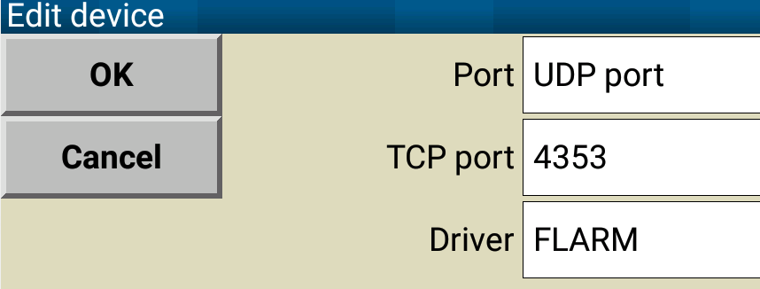

== About TraffiX

TraffiX is an app that listens on the local WiFi network for GDL90 data and displays this on a map, as well as retransmitting the data in FLARM format on a UDP socket.

A major use case for TraffiX is to receive GPS and traffic data from a SkyEcho2 Electronic Conspicuity device and relay the data to XCSoar running on the same phone or tablet.
XCSoar is unable to directly receive GDL90 data but most of the functionality of the data can be replicated by converting to FLARM format.

== Installation
Install the app from the Play Store either by searching, or use https://play.google.com/store/apps/details?id=com.controlj.traffic[this link]. After installation open the app - it is useful to pan and zoom the map around any locations of interest at this point to cache
the map data, which requires an internet connection.

== Usage

After installation, to use it follow these steps:

Connect the Android device via WiFi to a SkyEcho unit (Stratux ADSB receivers also work.) Consult the Skyecho documentation as required. The WiFi network provided by the Skyecho will usually have a name like "SKYECHO_1234" unless it has been changed in the settings.

Open the TraffiX app. The top (portrait mode) or left (landscape mode) bar will contain several boxes. Once the SkyEcho has a GPS fix this should look something like this:

image::screencap1.jpg[]

The three bar icon on the left if tapped will open a menu, allowing selection of several pages.
Each page is explained below.

=== Map view
The default page is a map view showing the current location of the SkyEcho on a map,
along with any traffic nearby. The map can be panned and zoomed with the usual touch gestures.

The map details are cached on the device, but must first be fetched from the internet. If you
reconnect the device to a WiFi network with internet access, then pan and zoom around the map
area of interest to you, map tiles will be fetched from the internet and stored locally, making
that data available later when not connected to the internet.

=== Settings page
Allows changing various display units and other parameters. The horizontal and vertical range
to filter traffic can be set here. Targets outside the range will not be forwarded to XCSoar
or shown on the map, but
will still be visible on the traffic page.

=== Traffic page
Shows all ADSB targets currently being received by the SkyEcho.

=== Shutdown
TraffiX will continue running in the background even when not visible, and will thus continue
to relay data to XCSoar. This requires showing a permanent notification in the Android status
bar. The Shutdown menu item will terminate the app completely, removing the notification.

There is no harm in leaving TraffiX running in the background even when not in use. It will not
use resources unless it starts receiving data.

== Connection to XCSoar
The data from TraffiX is broadcast in FLARM format to a UDP socket on the device's local network. To receive this
in XCSoar go to Config/Devices and add a new device. Choose UDP port, keep the default port number
of 4353, and choose FLARM as the device driver. Check for reception using the monitor function.
Now XCSoar will show ADSB targets like FLARM targets.

